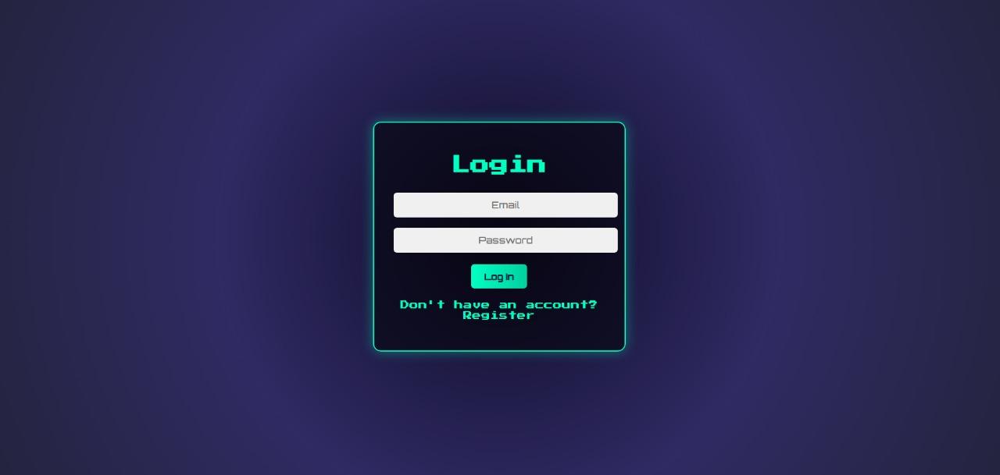
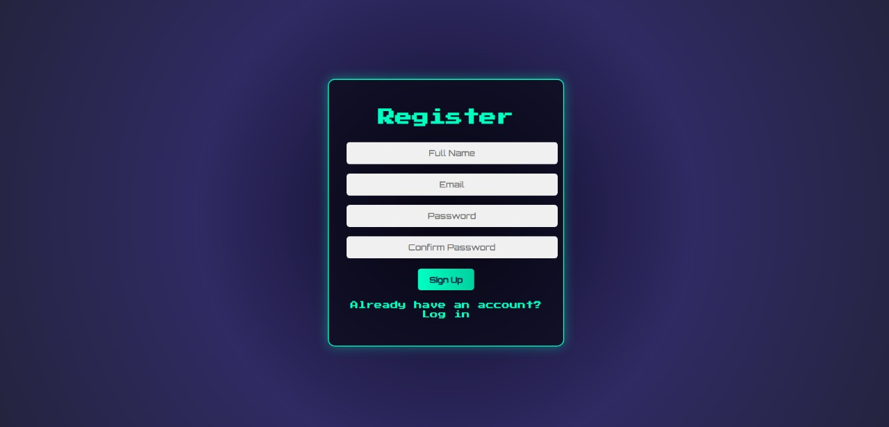
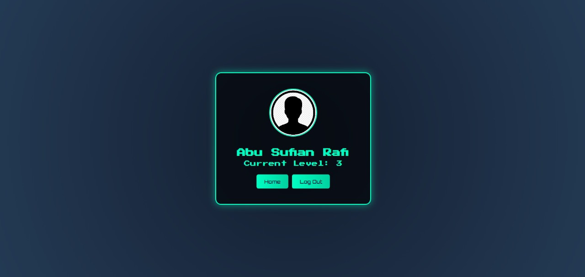

# 🔐 CipherPuzzle

**CipherPuzzle** is a retro-inspired, browser-based puzzle game that challenges players with cipher, clock, and bookshelf puzzles across multiple levels. Built using HTML, CSS, JavaScript, and Firebase, it provides a gamified platform for logic, codebreaking, and pattern recognition.

🌐 **Live Demo:** [https://cipherpuzzle.netlify.app/](https://cipherpuzzle.netlify.app/)

---

## 📁 Project Structure

```
├── BookSelfImages/       # Images for Level 2 bookshelf puzzle
├── Clock images/         # Images for Level 1 clock puzzle
├── sounds/               # Audio assets and sound effects
├── index.html            # Home/Landing page
├── login.html            # User login screen
├── registration.html     # User registration form
├── profile.html          # User profile (displays name & level completed)
├── logout.html           # Logs out and ends session
├── level1.html           # Caesar cipher challenge
├── level2.html           # Vernam cipher challenge
├── level3.html           # Hill cipher challenge
├── complete.html         # Game completion congratulations
├── firebase-config.js    # Firebase initialization (Auth & Firestore)
├── style.css             # Global/shared styles (if used)
├── profile_icon.png      # Default profile picture
└── README.md             # Project documentation
```

---

## 🚀 Key Features

* **User Authentication:** Email/password signup & login with Firebase Auth
* **Progress Tracking:** Firestore stores user progress (levels unlocked)
* **Dynamic Puzzles:** Three cipher levels (Caesar, Vernam, Hill) with media clues
* **Profile & Logout:** Personalized profile page and clean session sign-out
* **Retro Aesthetic:** 8-bit fonts, neon glow effects, immersive backgrounds
* **Hosted on Netlify:** Fast deployment and global CDN

---

## 🔧 Technologies Used

- HTML5 / CSS3  
- JavaScript (Vanilla)  
- Firebase Authentication & Firestore  
- Netlify for deployment  

---

## 🚀 How to Play

1. Log in using your credentials  
2. Start with Level 1 (Caesar Cipher)  
3. Solve puzzles using clues  
4. Progress to higher levels as they unlock  

---

## 📸 Screenshots

### 🔐 Login Page


### 📝 Register Page


### 🕹 Game Levels


### 👤 Profile Page


---

## 🛠️ Setup & Installation

1. **Clone Repository**

   ```bash
   git clone https://github.com/yourusername/cipherpuzzle.git
   cd cipherpuzzle
   ```

2. **Configure Firebase**

   * Create a Firebase project at [https://console.firebase.google.com/](https://console.firebase.google.com/)
   * Enable **Authentication** (Email/Password) and **Firestore Database**
   * Replace credentials in `firebase-config.js`:

     ```js
     const firebaseConfig = {
       apiKey: "YOUR_API_KEY",
       authDomain: "YOUR_AUTH_DOMAIN",
       projectId: "YOUR_PROJECT_ID",
       storageBucket: "YOUR_STORAGE_BUCKET",
       messagingSenderId: "YOUR_MESSAGING_SENDER_ID",
       appId: "YOUR_APP_ID",
       measurementId: "YOUR_MEASUREMENT_ID"
     };
     ```

3. **Run Locally**

   Serve files via a static server. Example using Python 3:

   ```bash
   python -m http.server 8000
   ```

   Open [http://localhost:8000](http://localhost:8000) in your browser.

---

## 🤝 Special Thanks

Contribution of my teammates *Abid Hussan* and *Noman Ahmed Rony*.
